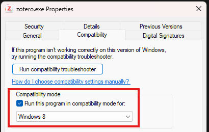
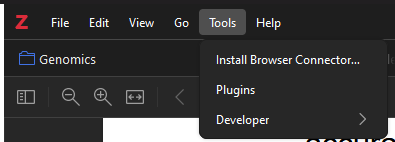
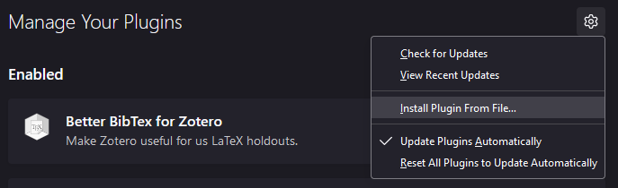
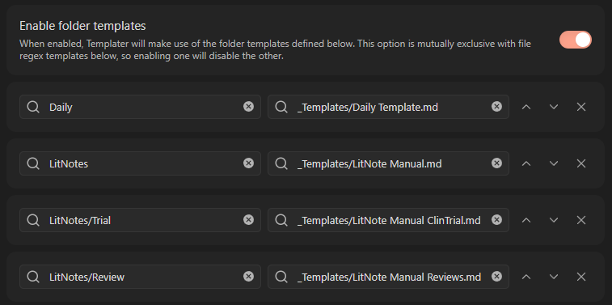

General overview of my digital workflow setup. Ocassionally updated.

# Reference manager: Zotero

Open source citation management, paper PDF organization, integration with word processors (Microsoft Word, Google Docs).

[Zotero download](https://www.zotero.org/download/)

- [Zotero Connector Chrome extension](https://chromewebstore.google.com/detail/zotero-connector/ekhagklcjbdpajgpjgmbionohlpdbjgc): auto pull paper metadata and PDF from webpage into Zotero

- Zotero only has 300 MB cloud storage on its free tier! I highly recommend using cloud storage for PDFs and using Linked Attachments.
    - Base directory: set to path to directory in cloud storage
        - Ex. `C:\Users\yliao\OneDrive - UBC\Zotero`
    - Data directory: leave as default!
        - Ex. `C:\Users\yliao\Zotero`

Filename Format template:
```
{{ firstCreator case="snake"}}{{ year suffix="_"prefix="_" }}{{ title truncate="80" case="snake"}}
```

Windows OS: If Zotero 7 doesn't launch, turn on Windows 8 compatibility mode

- Find `zotero.exe` (default is `"C:\Program Files\Zotero\zotero.exe"`), and right click into "Properties"
- Go to "Compatibility" tab, check "Run this program in compatibility mode for:" and make sure "Windows 8" is selected in drop-down menu



**Extensions**

- [Zotero Attanger](https://github.com/MuiseDestiny/zotero-attanger): auto-move and organize files
- [Better BibTeX for Zotero](https://retorque.re/zotero-better-bibtex/): bibliographic data management utilities, especially useful for citekey formulas
	- Current citekey formula: `auth.lower + '_' + shorttitle(1,1).lower + '_' + year`
- [Linter for Zotero](https://github.com/northword/zotero-format-metadata): mainly for the tool to standardize dates to ISO format

To install extensions from file: 

- Download the `.xpi` file
- Within Zotero go to Tools > Plugins
- Click the gear icon to the right of "Manage Your Plugins" > Install Plugin From File...




**Guides**

- [Using Zotero with Google Docs](https://www.zotero.org/support/google_docs)
- [Zotero Word Plugin](https://www.zotero.org/support/word_processor_plugin_usage)

----

# General IDE: VSCode

[VSCode download](https://code.visualstudio.com/download)

- [V1.98 download](https://code.visualstudio.com/updates/v1_98): the VPC Linux server runs an old Linux OS that is not supported by recent VSCode versions - this is the last version that supports Remote SSH! Make sure to AGGRESSIVELY turn off VSCode auto-update in settings before downgrading to V1.98!

**Extensions**

- [Remote - SSH](https://marketplace.visualstudio.com/items?itemName=ms-vscode-remote.remote-ssh)
- [Gremlins tracker for Visual Studio Code](https://marketplace.visualstudio.com/items?itemName=nhoizey.gremlins): reveals invisible characters and non-standard characters
- [vscode-pdf](https://marketplace.visualstudio.com/items?itemName=tomoki1207.pdf): display PDF files

## Running R in VSCode

[R in Visual Studio Code](https://code.visualstudio.com/docs/languages/r)
- Set R *path* setting to R executable path (ex. `/usr/local/bin/R`)

- [R extension](https://marketplace.visualstudio.com/items?itemName=REditorSupport.r)
- [radian](https://github.com/randy3k/radian): alternative R console with syntax highlighting and multiline editing
    - Set bracketed paste to `true`
    - Set R *terminal* to radian path (ex. `/home/yliao/miniforge3/bin/radian`)
    - If `CTRL+Enter` keeps creating a new R Interactive session, can try turning "Always Use Active Terminal" off
- [R Debugger](https://marketplace.visualstudio.com/items?itemName=RDebugger.r-debugger)

[vscode-R: Interacting with R terminals](https://github.com/REditorSupport/vscode-R/wiki/Interacting-with-R-terminals)

For self-managed R terminals, add these lines to `~/.Rprofile`:
```{r}
if (interactive() && Sys.getenv("RSTUDIO") == "") {
  Sys.setenv(TERM_PROGRAM = "vscode")
  source(file.path(Sys.getenv(
    if (.Platform$OS.type == "windows") "USERPROFILE" else "HOME"
  ), ".vscode-R", "init.R"))
}
```

Snippet of R VSCode settings (JSON)
```{json}
  "r.plot.useHttpgd": true,
  "r.lsp.diagnostics": false,
  "r.alwaysUseActiveTerminal": true,
  "r.rterm.windows": "C:\\Users\\yliao\\AppData\\Local\\Programs\\Python\\Python312\\Scripts\\radian.exe",
  "r.rpath.windows": "C:\\Program Files\\R\\R-4.3.2\\bin\\R.exe",
  "r.rpath.linux": "/usr/local/bin/R",
  "r.rterm.linux": "/home/yliao/miniforge3/bin/radian",
  "r.removeLeadingComments": true,
  "r.session.levelOfObjectDetail": "Normal",
  "r.bracketedPaste": true,
```

**$\LaTeX$ in VSCode**

- [LaTeX Workshop](https://marketplace.visualstudio.com/items?itemName=James-Yu.latex-workshop)

----

# Digital brain: Obsidian

[Obsidian download](https://obsidian.md/download)

Markdown-based note-taking.

My Obsidian vault is currently stored in 100GB Google Drive (paid plan...) and periodically backed up to GitHub repository.

## Community plugins

Core:

- [Dataview](https://github.com/blacksmithgu/obsidian-dataview): enable data index and query for MD files
- [Git](https://github.com/denolehov/obsidian-git): back up entire vault to a GitHub repository
  - I only run Git sync on my laptop to prevent weird conflict issues across multiple devices - there is a "Disable on this device" setting.
- [Templater](https://github.com/silentvoid13/Templater): template plugin that can execute JavaScript code, can automate creation of daily notes
    - [Dann Berg: My Obsidian Daily Note Template](https://dannb.org/blog/2022/obsidian-daily-note-template/)

Zotero:

- [Zotero Integration](https://github.com/mgmeyers/obsidian-zotero-integration): add cite-key & citations from Zotero, import notes & metadata as templated LitNotes
  - [Danny Hatcher: Zotero Obsidian Integration](https://www.youtube.com/watch?v=CGGeMrtyjBI) LitNotes overview
  - [Alexandra Phelan: An Updated Academic Workflow: Zotero & Obsidian](https://medium.com/@alexandraphelan/an-updated-academic-workflow-zotero-obsidian-cffef080addd)
- [Pandoc Reference List](https://github.com/obsidian-community/obsidian-pandoc-reference-list): display a formatted reference in Obsidian's sidebar for each pandoc citekey in the active document

Functionality:

- [Advanced Tables](https://github.com/tgrosinger/advanced-tables-obsidian): improved table manipulation
- [Extended MathJax](https://github.com/wei2912/obsidian-latex): extends MathJax LaTeX support
- [File Cleaner Redux](https://github.com/husjon/obsidian-file-cleaner-redux): helper to remove unused/empty MD files and attachments
- [Better Word Count](https://github.com/lukeleppan/better-word-count): counts words of selected text in editor

Import/Export:

- [Excel to Markdown Table](https://github.com/ganesshkumar/obsidian-excel-to-markdown-table): paste tables from Excel/Sheets as MD tables
- [Markdown Export](https://github.com/bingryan/obsidian-markdown-export-plugin): export directory/single MD (including pictures) to a folder

## Templates

- <a href="templates/Daily%20Template.md" target="_blank" download>Daily Template</a>
- <a href="templates/LitNote%20Manual.md" target="_blank" download>LitNote</a>
  - <a href="templates/LitNote%20Manual%20ClinTrial.md" target="_blank" download>LitNote: Clinical Trial</a>
  - <a href="templates/LitNote%20Manual%20Reviews.md" target="_blank" download>LitNote: Reviews</a>

The `Daily notes` Core plugin automatically places new file locations in my `/Daily` folder under custom format `YYYY/YYYY-MM/YYYY-MM-DD-ddd`.

For LitNotes, I use Templater to automatically apply these templates depending on the folder that the note is created in.



----

# SSHFS-Win

- [WinFsp](https://github.com/winfsp/winfsp/releases/tag/v2.0)
- [SSHFS-Win](https://github.com/winfsp/sshfs-win)
- [SSHFS-Win Manager](https://github.com/evsar3/sshfs-win-manager) - GUI interface for SSHFS-Win

----

# Miscellaneous

To-do list: [Todoist](https://www.todoist.com/) (free tier!)

[PPspliT](https://github.com/maxonthegit/PPspliT): PowerPoint add-in that splits animations steps into separate slides for ease of export to PDF